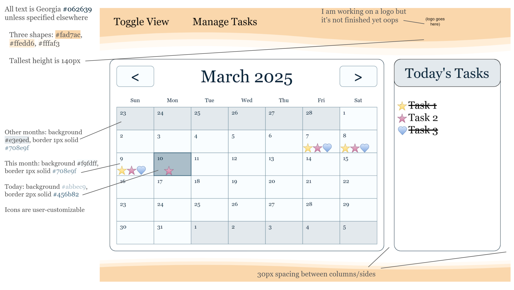
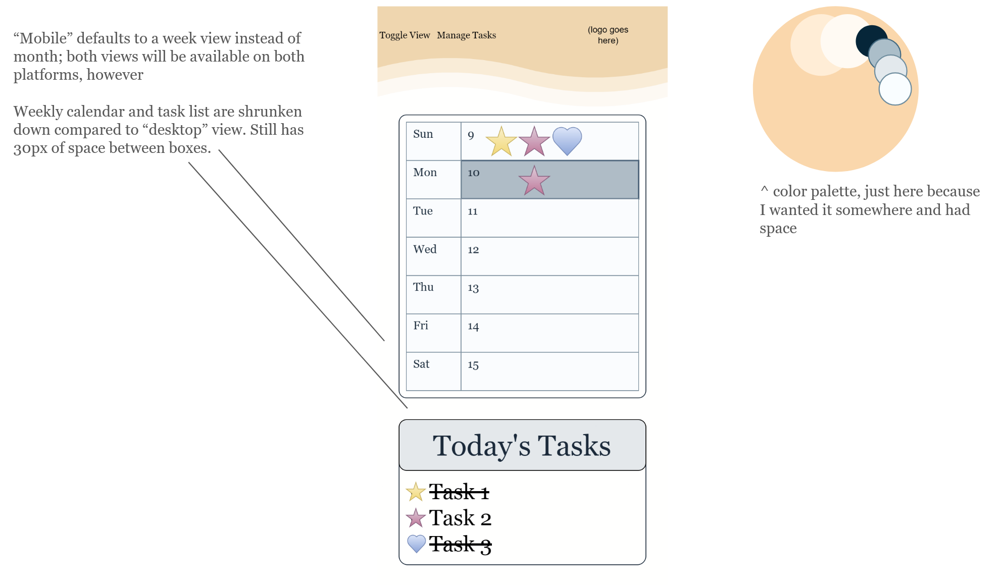

# A Simple Habit Tracker

## Purpose

To provide users with direct feedback on their daily habits in a pleasant and intuitive interface. Habits can be hard to form and take several weeks to become part of someone’s daily routine. With our Simple Habit Tracker, it enables the user to receive visual feedback of their progress in maintaining one or more habits. Enabling the user to browse through the months and view their progress (or lack-thereof) of accomplishing their daily habits. The inspiration for this project can be accredited to Simone Giertz, [who made a physical habit tracker](https://www.youtube.com/watch?v=-lpvy-xkSNA&feature=youtu.be) using buttons and LED lights. The duck logo is a reference to our team name, [Spatula](https://en.wikipedia.org/wiki/Spatula_(bird)), a genus of birds.

## Users

### The Target Audience
This habit tracker is primarily designed for individuals who wish to form healthy habits in their daily lives. If there is a skill you want to practice everyday, such as learning a new language or a new skateboard trick; you can track that. If there is a habit you want to form, such as meditation, working out, or a daily chore you haven’t gotten in the routine for; you can track that. This Simple Habit Tracker allows its users to set personalized goals that align with their personal lives

### A Group Audience 
The Simple Habit Tracker at its core, allows a visible representation of completed daily tasks. Which means it could also be used in a group setting for keeping track of daily tasks that need to be done by a group. Say you own cats with your roommates and everyone agrees they collectively need a way to keep track of if the litter has been emptied and when. One such group could use this tracker, and even tell who did it if they set the “habits” to their name! Thus creating a color-coded calendar over time of who did that particular chore while hopefully not ensuing drama. 

## Features
- Mobile User Interface
- Custom Task (Habit) names 
- Color and icon customization for the task icons 
- Off days: Specify off days to where you can “cheat” on your habit progress
- Toggle between a full calendar view and weekly view

## Data
This Simple Habit Tracker will take advantage of a (tbd) calendar API that enables us to display an accurate calendar in any given year, month or week. Users can create, edit, and delete tasks which will be saved to the browser’s local storage. Additional data will be created when a user indicates that they have performed a task for a particular day. Users can read this data by viewing the calendar and navigating to the day where the task was completed. Users can also update the calendar by deleting task “completions” on a particular day, this action will likely occur when a user sets a task as “complete” by mistake. 

## Concept
A visual representation of our project goals can be found below... 

### Desktop interface:

### Mobile Interface:
